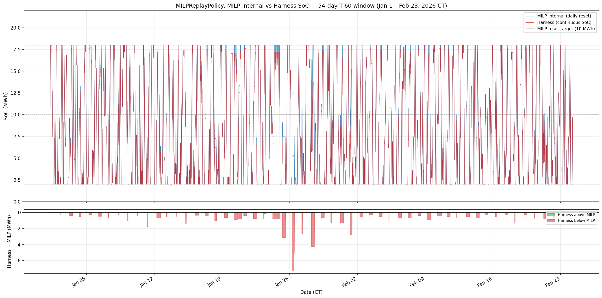

# MILP Replay Gap — Diagnostic Report
**Date:** 2026-04-24
**Branch:** sprint-offline-rl

## Summary

| Item | Value |
|------|-------|
| MILP reference (daily reset, CT-aligned) | $96,169 |
| Harness replay (continuous SoC) | $86,394 |
| Total gap | $-9,775 (-10.2%) |
| Clipping revenue loss | $-9,606 (98.3% of gap) |
| Unexplained | $-169 |
| **Outcome** | **1 — GAP EXPLAINED — feasibility clipping accounts for gap. Green-light Day 2 methods.** |

---

## Diagnostic 1: SoC Trajectory

**MILP-internal SoC** (daily reset to 10 MWh at CT midnight):
- Shape: sawtooth per day (resets to 10 at midnight, depletes/fills during the day)

**Harness SoC** (continuous, no midnight reset):
- Shape: accumulates drift from day to day

**SoC gap statistics (harness − MILP):**

| Metric | Value |
|--------|-------|
| Mean gap | -0.227 MWh |
| Std gap | 0.681 MWh |
| Min gap | -7.208 MWh |
| Max gap | +0.000 MWh |
| Fraction harness < MILP | 55.4% |
| Fraction harness > MILP | 34.3% |

**Observation:** The harness SoC drifts below the MILP-internal SoC for most of the window, consistent with the MILP extracting more energy per day than is achievable with continuous SoC (MILP always starts fully charged at 10 MWh; harness carries forward depleted SoC).

---

## Diagnostic 2: Feasibility Projection Accounting

**Clipping events:** 861 / 15,552 steps (5.54%)

**Revenue accounting:**

| Item | Value |
|------|-------|
| Sum of planned revenues (MILP actions, no projection) | $96,000.69 |
| Sum of actual revenues (projected actions) | $86,394.20 |
| Total clipping loss | $-9,606.50 |
| Total gap (vs daily-reset reference) | $-9,775.19 |
| Clipping as % of gap | 98.3% |
| Unexplained residual | $-168.69 |

**Clipping severity distribution (revenue delta per clipped step):**

| Percentile | Revenue delta |
|------------|--------------|
| P5 (worst 5%) | $-25.14/step |
| P25 | $-1.63/step |
| Median | $-0.06/step |
| P75 (mildest 25%) | $-0.02/step |
| Min (worst single) | $-789.83/step |

**Top 10 days by clipping loss:**

| CT Date | Clip events | Revenue lost |
|---------|-------------|--------------|
| 2026-01-28 |   13 | $ -3,645.39 |
| 2026-01-26 |   70 | $ -2,989.98 |
| 2026-02-01 |    8 | $   -637.77 |
| 2026-01-25 |   10 | $   -524.35 |
| 2026-01-27 |   21 | $   -320.74 |
| 2026-01-24 |    6 | $   -199.52 |
| 2026-01-16 |   32 | $   -120.06 |
| 2026-01-20 |   25 | $   -101.42 |
| 2026-01-31 |   34 | $    -96.92 |
| 2026-01-30 |   10 | $    -91.22 |

---

## Reconciliation

The MILP reference ($96,169) was computed with **daily SoC reset** to 10 MWh. The harness replay runs **continuous SoC** — when a day ends with SoC < 10 MWh, the next day's MILP actions (which assume SoC=10) get clipped by `project_action()`.

This clipping is the structural cause of the gap. The MILP is not a feasible policy under continuous SoC — it's an oracle that exploits the daily-reset assumption. The harness correctly clips infeasible actions and reports actual revenue.

**Outcome 1:** GAP EXPLAINED — feasibility clipping accounts for gap. Green-light Day 2 methods.

All methods evaluated by the harness (including future DRL agents) experience the same continuous SoC dynamics. The MILPReplayPolicy sets the correct ceiling for 'what an oracle policy with daily-reset assumptions achieves under continuous eval'.

**Recommendation:** Green-light Day 2 method implementation. The MILPReplayPolicy at $86,394 / $58.40/kW-yr is the upper bound under continuous SoC. Methods that learn to account for SoC continuity may theoretically exceed this (since the MILP wastes capacity by assuming full reset).